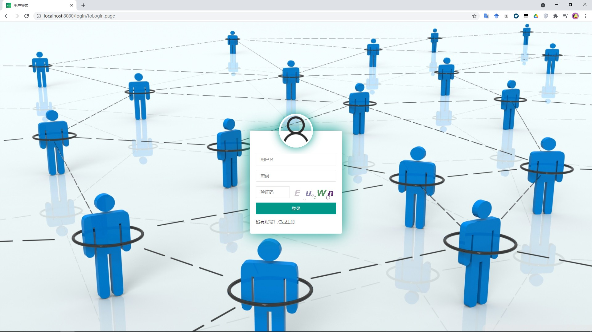
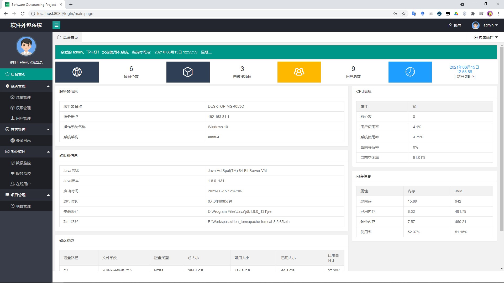
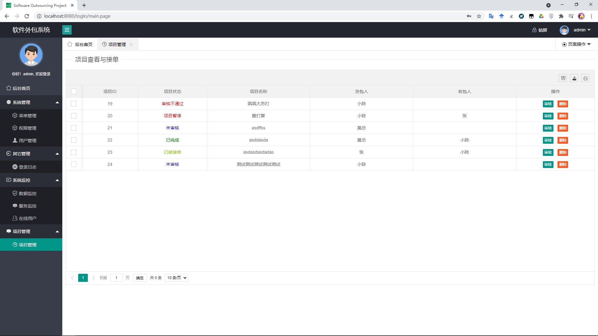
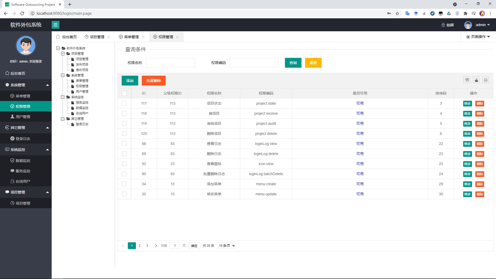

# softwareout
基于ssm的软件外包后台管理系统

使用技术：

后端

- spring、springmvc、mabits
- shiro

前端：

- layui

## 平台简介

做的一个软件平台外包分发项目。

## 内置功能

1.  用户管理：用户是系统操作者，该功能主要完成系统用户配置
2.  权限管理：增删改查权限，管理权限可用状态
4.  菜单管理：配置系统菜单，操作权限，按钮权限标识等
5.  日志管理：管理系统的登录日志
8.  连接池监视：监视当前系统数据库连接池状态，可进行分析SQL找出系统性能瓶颈
9.  服务监控：对系统各种资源，如JVM、CPU、磁盘、内存等信息进行监控
11. 在线用户：当前系统中活跃用户状态监控
8.  项目管理：对项目进行操作，可以实现项目的发布、接收、审核等功能。

## 演示图

<table>
    <tr>
        <td></td>
        <td></td>
    </tr>
    <tr>
        <td></td>
        <td></td>
    </tr>

</table>